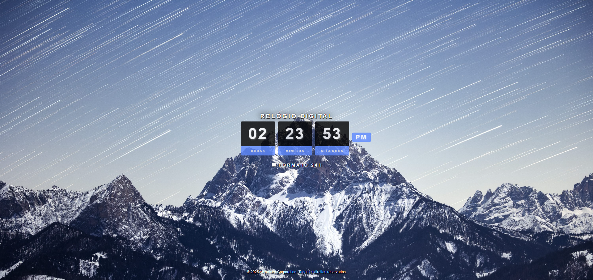
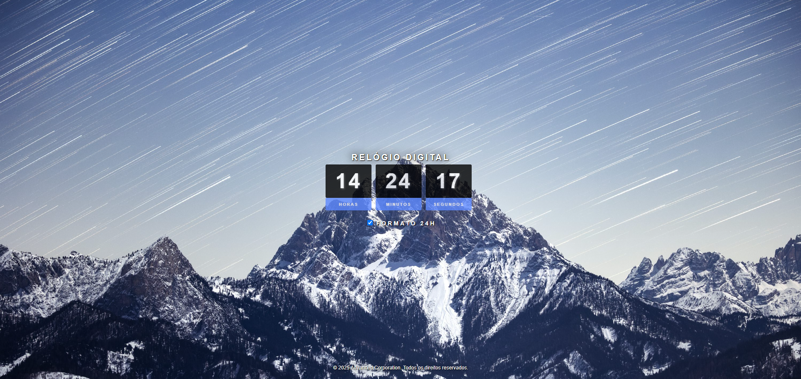

# 🕒 Relógio Digital Interativo

<p align="center">
  
</p>

<p align="center">
   
  
</p>

<p align="center">
  <b>Um relógio digital moderno, responsivo e funcional, desenvolvido com HTML, CSS e JavaScript.</b><br>
  🌗 Alterna entre formato 12h e 24h com um clique!
</p>

---

## 🚀 Funcionalidades

✨ Exibe as **horas, minutos e segundos** em tempo real.  
🔁 Atualiza automaticamente a cada segundo.  
🌓 Alternância fácil entre **formato 12h (AM/PM)** e **24h**.  
🎨 Fundo com **imagem moderna** e **design minimalista**.  
📱 Totalmente **responsivo e leve**.  
🖋️ Inclui **créditos no rodapé**.

---

## 🧩 Estrutura do Projeto

```
📂 Relogio-Digital
├── index.html        # Estrutura principal do relógio
├── assets/
│   ├── css/
│   │   └── styles.css   # Estilos e layout
│   ├── js/
│   │   └── script.js    # Lógica de funcionamento
│   ├── img/
│   │   ├── 12h.png      # Imagem do relógio em formato 12h
│   │   └── 24h.png      # Imagem do relógio em formato 24h
```

---

## 📸 Demonstração dos Modos

### 🕐 Formato 12 Horas (AM/PM)
No formato **12h**, o relógio exibe a hora com **indicador AM ou PM**, mostrando claramente se é manhã ou tarde/noite.

Exemplo:
```
03:45:12 PM
```
> 💡 Ideal para quem prefere a forma tradicional de exibição de horas.

### 🕓 Formato 24 Horas
No formato **24h**, o relógio mostra o tempo de forma contínua (sem AM/PM), muito usado em ambientes profissionais e técnicos.

Exemplo:
```
15:45:12
```
> ⚙️ Mais comum em sistemas militares, científicos e no padrão internacional.

---

## ⚙️ Como Usar

1. 📦 **Baixe ou clone** este repositório:
   ```bash
   git clone https://github.com/willianduraes/relogio-digital.git
   ```

2. 🧭 **Abra o arquivo `index.html`** no navegador.

3. ✅ **Ative ou desative o modo 24h** marcando a caixa “Formato 24H”.

> ⏱️ O relógio atualiza automaticamente a cada segundo.

---

## 🧠 Como Funciona o Código

🕹️ O `script.js` usa o objeto `Date()` para capturar o horário atual e atualizar os elementos HTML a cada segundo.  
🌗 O **checkbox** alterna o formato entre **12h e 24h**, controlando a exibição do elemento **AM/PM**.  

---

## 💡 Tecnologias Utilizadas

| Tecnologia | Descrição |
|-------------|------------|
| 🧱 **HTML5** | Estrutura e conteúdo do relógio |
| 🎨 **CSS3**  | Design, fundo e layout responsivo |
| ⚙️ **JavaScript (ES6)** | Lógica do relógio e atualização em tempo real |

---

## 🧑‍💻 Autor

Feito com 💙 por **Willian Durães**  
📧 [Entre em contato]()  
📸 [Instagram](https://www.instagram.com/021_2lw/) | 💼 [LinkedIn](https://www.linkedin.com/in/willian-dur%C3%A3es-42443035a/)

---

## 🪪 Licença

Este projeto está sob a licença **MIT** — sinta-se livre para usar e modificar!  
⭐ Se gostou do projeto, deixe uma **estrela** no repositório!

---

<h3 align="center">⌛ “O tempo não espera por ninguém, mas você pode acompanhar ele com estilo.” ⌛</h3>
